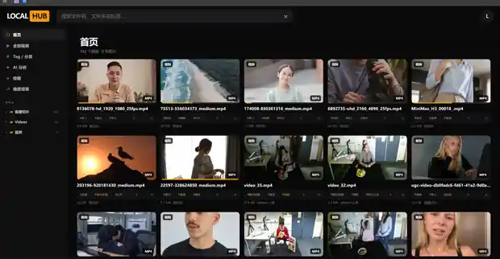
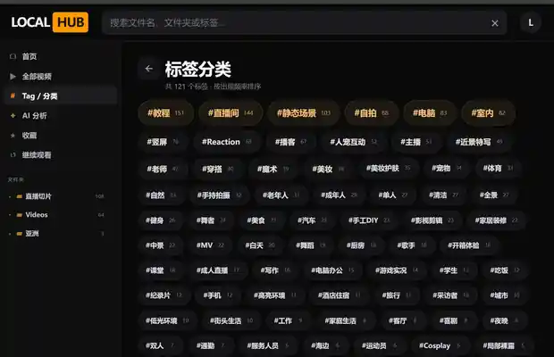

<div align="center">


# LocalHub

### 把硬盘里的视频、图片和图包，变成你的私人媒体站

**纯本地运行 · AI 自动标签 · 封面墙 · 本地推荐 · 播放 / 整理 · Windows 单 EXE**

[English](README_EN.md) · [标准版 EXE](../../releases/latest/download/LocalHub.exe) · [LocalHub with AI](../../releases/latest/download/LocalHub-with-AI.zip) · [发行说明](RELEASE_NOTES.md)

[](../../releases/latest)


</div>



## 下载

| 版本 | 适合谁 | 内容 |
|---|---|---|
| **LocalHub 标准版** | 想先体验媒体库，之后再按需启用 AI | `LocalHub.exe`，约 75MB；AI 模型可在需要时再下载 |
| **LocalHub with AI** | 想一次下载好，之后直接在本机使用 AI | `LocalHub-with-AI.zip`，包含 LocalHub 和约 206MB 的 SigLIP INT8 本地模型 |

**LocalHub with AI 使用方式：** 解压 ZIP 后，双击 `LocalHub with AI.cmd`。第一次启动会把随包附带的模型复制到当前 Windows 用户的 LocalHub 本地模型目录，之后不需要再次下载模型。

> 两个版本使用的是同一套 LocalHub 程序。`with AI` 只是把固定版本的本地 AI 模型一起打包，方便离线准备和一次性交付。

## 你的文件夹，不应该只是文件名

如果硬盘里已经堆了几百、几千个视频和图片，真正麻烦的往往不是“能不能播放”，而是：

- 文件夹越来越复杂，想找一段视频只能翻目录；
- 内容太多，靠手工分类和改名很难坚持；
- 收藏、观看进度、标签散在不同地方；
- 很多素材舍不得删，但也很少再被重新发现。

**LocalHub 的目标很简单：不搬走你的文件，只给它们一个更好用的界面。**

```text
普通文件夹
video_001.mp4
final_final2.mp4
新建文件夹 (4)
IMG_2381.jpg
        ↓
LocalHub
封面墙 · 标签 · 搜索 · 收藏 · 继续观看 · 本地推荐
```

## 核心体验

| | 功能 | 你得到什么 |
|---|---|---|
| 🤖 | **本地 AI 自动标签** | 用轻量本地模型识别媒体内容，自动生成可搜索的标签；媒体本身无需上传云端 |
| 🎞️ | **私人媒体墙** | 视频、图片和图包用封面浏览，不再对着一串文件名找内容 |
| #️⃣ | **Tag / 分类** | 标签按出现频率聚合，可筛选、补充、删除和继续整理 |
| ✨ | **本地推荐** | 根据本地元数据与内容关系重新发现媒体，整个推荐过程留在本机 |
| ▶️ | **播放器** | 继续观看、倍速、音量、全屏、系统播放器；常见容器按需做兼容播放 |
| 📁 | **边看边整理** | 改名、移动、收藏、评分，整理动作直接发生在真实文件上 |
| 🖼️ | **图片 / 图包阅读** | 图片目录自动作为图包阅读，长图和漫画页按阅读场景展示 |
| 🔎 | **搜索** | 文件名、文件夹和 Tag 一起搜，适合大媒体库快速定位 |

### AI 自动分类，不需要把媒体交给云端



LocalHub 的 AI Tag 设计为**本地优先**：

- 轻量 AI 模型约 206MB，采用 SigLIP Base Patch16-224 INT8 ONNX；
- 标准版可以在需要时再下载模型，`LocalHub with AI` 则已经把模型一起打包；
- 识别和标签匹配在本机完成；
- 适合普通 Windows PC，不以高端显卡为前提；
- 标签会继续保存在 LocalHub 的本地元数据中。

> 下载程序 / AI 模型时可能需要网络；如果使用 `LocalHub with AI` 完整包，模型本身已经随包提供。**实际管理和识别自己的媒体时不需要把视频或图片上传到远程服务。**

### 播放、标签、收藏和推荐在同一个页面


打开一个视频后，不需要在播放器、资源管理器和笔记软件之间来回切换：

- 直接播放并记录进度；
- 查看和调整 AI / 手工标签；
- 收藏；
- 一键进入整理；
- 查看本地推荐；
- 必要时调用系统播放器。

## 3 步开始

**标准版：**

1. 下载 `LocalHub.exe`。
2. 把 EXE 放进你的媒体总目录。
3. 双击运行，LocalHub 会自动打开浏览器界面。

**LocalHub with AI：**

1. 下载并解压 `LocalHub-with-AI.zip`。
2. 把解压后的文件夹放到你希望的位置。
3. 双击 `LocalHub with AI.cmd`，首次运行会安装随包附带的本地 AI 模型并启动 LocalHub。

```text
你的媒体库/
├─ LocalHub.exe
├─ Videos/
├─ Photos/
├─ Courses/
└─ 任何你原本就在使用的文件夹/
```

不需要安装 Python、Node.js 或手动配置 Web 服务器。

## 纯本地，是什么意思？

LocalHub 默认只监听：

```text
127.0.0.1
```

也就是只在当前电脑访问。

运行时的核心原则：

- 不需要账号；
- 不需要把媒体上传到服务器；
- Tag、评分、收藏和观看进度保存在本机；
- 搜索基于本地索引；
- AI Tag 在本机运行；
- 原始媒体仍然保留在你自己的目录里。

**LocalHub 不是网盘，也不会替你接管媒体文件。**

## 对大媒体库做了什么

LocalHub 不会把几千个视频同时塞进浏览器。

它采用轻量索引和按需加载：

- 首页只加载少量媒体；
- “全部视频 / 文件夹 / 搜索”分页显示；
- 缩略图按需要生成；
- 鼠标悬停预览只处理当前目标；
- 第二次启动可先使用已有索引，再后台刷新目录。

因此它更适合“内容很多”的本地库，而不是只做一个漂亮的播放器壳。

## 常见视频兼容

浏览器不能天然播放所有 `AVI / MPG / TS / MKV` 内容，所以 LocalHub 会根据实际编码选择：

```text
浏览器原生可播
→ 直接播放

容器不友好、编码可用
→ 本地 remux

编码不适合浏览器
→ 生成本地兼容版本
```

原始文件不会被覆盖。

### 支持格式

**视频**

`mp4` `webm` `m4v` `mov` `mkv` `avi` `ogv` `mpeg` `mpg` `ts`

**图片**

`jpg` `jpeg` `png` `webp` `gif` `avif` `bmp` `svg`

## 文件操作说明

LocalHub 的“改名”和“移动”是真实文件操作，而不是只改数据库里的显示名称。

为减少误操作：

- 改名保留扩展名；
- 移动时阻止覆盖同名文件；
- Tag、评分、收藏和观看进度会尽量跟随新路径迁移。

重要媒体仍建议保留正常备份习惯。

## Windows SmartScreen

当前公开构建尚未使用商业代码签名证书，因此 Windows 第一次运行时可能出现“发布者未知”的 SmartScreen 提示。

正式 Release 会同时提供 SHA256 校验文件，便于核对下载完整性。

## 开发者

普通用户只需要 Release 中的 Windows EXE，或者选择已经附带模型的 `LocalHub-with-AI.zip`。

从源码构建：

```powershell
.\build_windows.ps1
```

项目包含针对目录索引、播放器、缩略图、Tag / 评分、文件操作和 Windows 单文件打包的自动化测试。

源码公开在本仓库，便于安全审阅、学习和提出改进建议。

---

<div align="center">

### LocalHub

**Your files. Your library. Your machine.**

[标准版 EXE](../../releases/latest/download/LocalHub.exe) · [LocalHub with AI](../../releases/latest/download/LocalHub-with-AI.zip) · [English README](README_EN.md)

</div>
